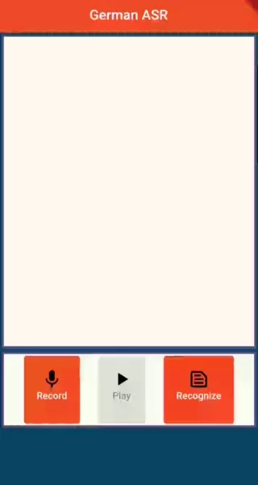

# volleRede
## A flutter application to transcribe German speech on the mobile device

When I first moved to Germany, understanding german was a hassle for me. I need an app to transcribe human speech, but (1) sending people's voices to unknown third parties was something I would like to avoid, and (2) current solutions were slow. This app emerged as a solution to given problems. It performs reasonably accurately, and it is fast. It can transcribe a sentence consisting of 20 words in 1~ second. The performance is dependent on the device model.

## MODEL FILES
You can only find the quantized model, which pays the price of accuracy by being more than three times smaller (in file size). The reason behind this is to avoid uploading a big model file into a git repository.

### Where to find a better model
If you would like to have the complete model, you need to use the repository given below:

https://github.com/AASHISHAG/deepspeech-german

Here, there is a script named export_tflite, please check [this section](https://github.com/AASHISHAG/deepspeech-german#tflite-model-generation)

If you want to use another language, take a look at [Scribosermo repository](https://gitlab.com/Jaco-Assistant/Scribosermo)

### Contribution
Feel free to send a pull request!